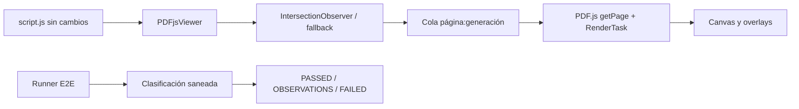
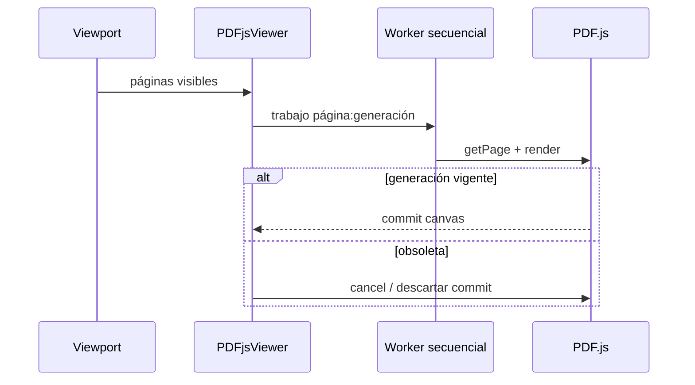

# Diagramas

## Componentes

```mermaid
flowchart LR
  UI[script.js sin cambios] --> V[PDFjsViewer]
  V --> O[IntersectionObserver / fallback]
  O --> Q[Cola página:generación]
  Q --> P[PDF.js getPage + RenderTask]
  P --> C[Canvas y overlays]
  E[Runner E2E] --> R[Clasificación saneada]
  R --> S[PASSED / OBSERVATIONS / FAILED]
```

## Secuencia principal

```mermaid
sequenceDiagram
  participant O as Viewport
  participant V as PDFjsViewer
  participant Q as Worker secuencial
  participant P as PDF.js
  O->>V: páginas visibles
  V->>Q: trabajo página:generación
  Q->>P: getPage + render
  alt generación vigente
    P-->>V: commit canvas
  else obsoleta
    V->>P: cancel / descartar commit
  end
```

El diagrama individual está en `Diagramas/planificador-estados.md`.
