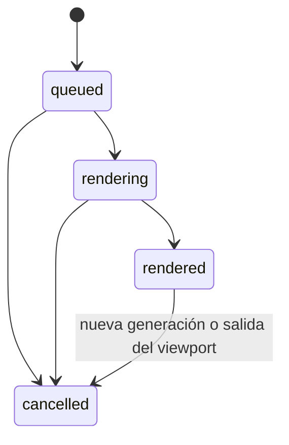

# Máquina de estados del render

```mermaid
stateDiagram-v2
  [*] --> queued
  queued --> rendering
  rendering --> rendered
  queued --> cancelled
  rendering --> cancelled
  rendered --> cancelled: nueva generación o salida del viewport
```

La identidad es `pageNumber:generation`; una identidad no inicia dos `RenderTask` efectivos.
