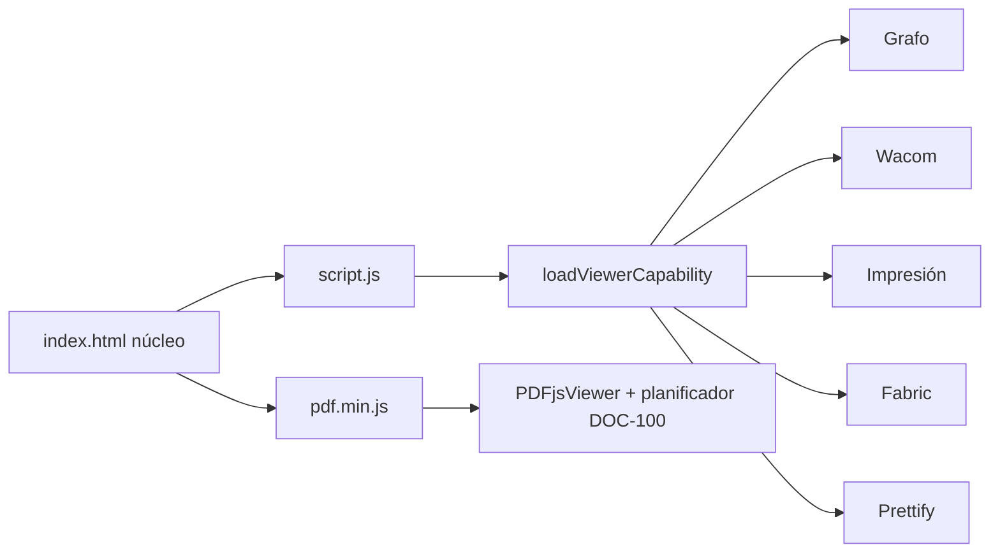
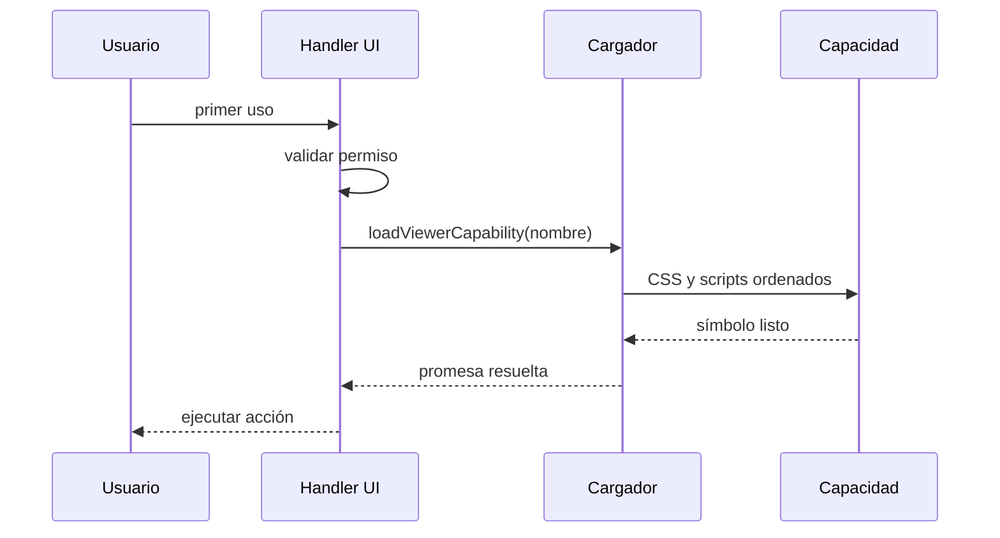

# Diagramas

## Componentes

```mermaid
flowchart LR
  H[index.html núcleo] --> P[pdf.min.js]
  H --> S[script.js]
  S --> L[loadViewerCapability]
  L --> G[Grafo]
  L --> W[Wacom]
  L --> I[Impresión]
  L --> F[Fabric]
  L --> R[Prettify]
  P --> V[PDFjsViewer + planificador DOC-100]
```

## Secuencia

```mermaid
sequenceDiagram
  participant U as Usuario
  participant H as Handler UI
  participant L as Cargador
  participant C as Capacidad
  U->>H: primer uso
  H->>H: validar permiso
  H->>L: loadViewerCapability(nombre)
  L->>C: CSS y scripts ordenados
  C-->>L: símbolo listo
  L-->>H: promesa resuelta
  H-->>U: ejecutar acción
```

El diagrama de estados individual está en `Diagramas/carga-capacidad.md`.
