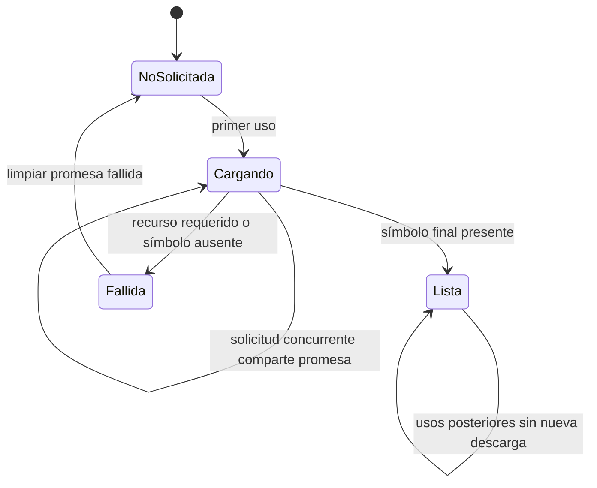

# Estado de una capacidad diferida

```mermaid
stateDiagram-v2
  [*] --> NoSolicitada
  NoSolicitada --> Cargando: primer uso
  Cargando --> Cargando: solicitud concurrente comparte promesa
  Cargando --> Lista: símbolo final presente
  Cargando --> Fallida: recurso requerido o símbolo ausente
  Fallida --> NoSolicitada: limpiar promesa fallida
  Lista --> Lista: usos posteriores sin nueva descarga
```
