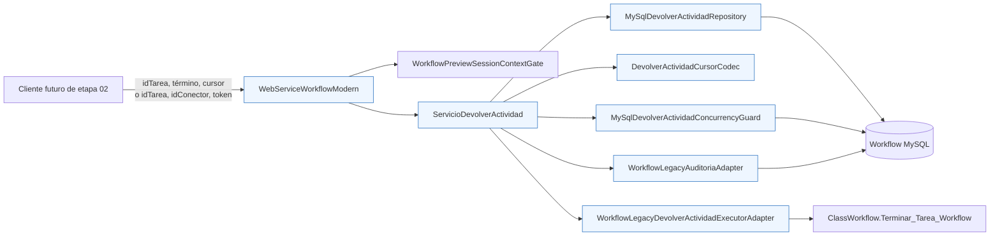

# Componentes y fronteras de DOC-32

```mermaid
flowchart LR
    Cliente[Cliente futuro de etapa 02] -->|idTarea, término, cursor\no idTarea, idConector, token| ASMX[WebServiceWorkflowModern]
    ASMX --> Sesion[WorkflowPreviewSessionContextGate]
    ASMX --> Servicio[ServicioDevolverActividad]
    Servicio --> Repositorio[MySqlDevolverActividadRepository]
    Servicio --> Cursor[DevolverActividadCursorCodec]
    Servicio --> Guard[MySqlDevolverActividadConcurrencyGuard]
    Servicio --> Adaptador[WorkflowLegacyDevolverActividadExecutorAdapter]
    Servicio --> Auditoria[WorkflowLegacyAuditoriaAdapter]
    Repositorio --> MySQL[(Workflow MySQL)]
    Guard --> MySQL
    Adaptador --> Motor[ClassWorkflow.Terminar_Tarea_Workflow]
    Auditoria --> MySQL

    classDef boundary fill:#eef6ff,stroke:#276fbf;
    class ASMX,Servicio,Repositorio,Cursor,Guard,Adaptador,Auditoria boundary;
```

El cliente no llega a MySQL ni al motor legacy. El ASMX reconstruye el contexto y el servicio decide el único punto mutante después de revalidar el destino.
