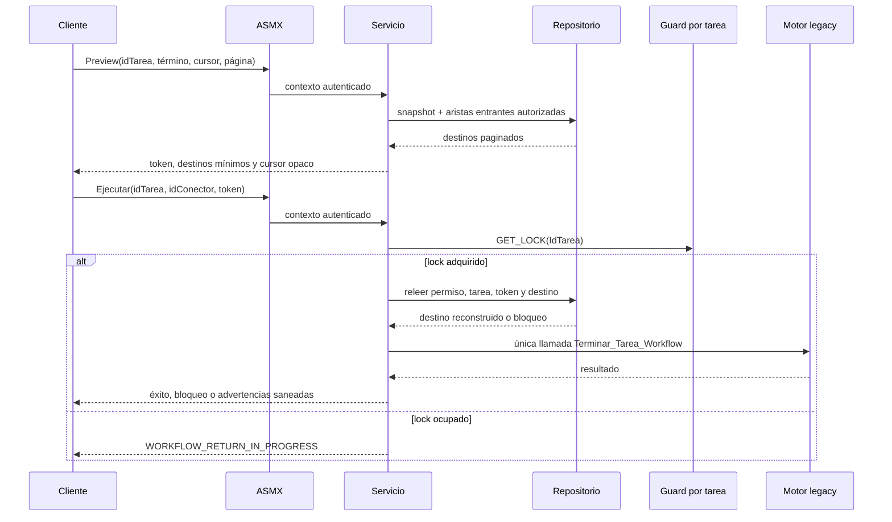

# Secuencia de preview y ejecución DOC-32

```mermaid
sequenceDiagram
    participant C as Cliente
    participant A as ASMX
    participant S as Servicio
    participant R as Repositorio
    participant G as Guard por tarea
    participant L as Motor legacy

    C->>A: Preview(idTarea, término, cursor, página)
    A->>S: contexto autenticado
    S->>R: snapshot + aristas entrantes autorizadas
    R-->>S: destinos paginados
    S-->>C: token, destinos mínimos y cursor opaco

    C->>A: Ejecutar(idTarea, idConector, token)
    A->>S: contexto autenticado
    S->>G: GET_LOCK(IdTarea)
    alt lock adquirido
        S->>R: releer permiso, tarea, token y destino
        R-->>S: destino reconstruido o bloqueo
        S->>L: única llamada Terminar_Tarea_Workflow
        L-->>S: resultado
        S-->>C: éxito, bloqueo o advertencias saneadas
    else lock ocupado
        S-->>C: WORKFLOW_RETURN_IN_PROGRESS
    end
```

Preview no toma lock ni muta. Ejecución no confía en el destino del cliente: el conector y token solo permiten localizar y revalidar el estado actual.
