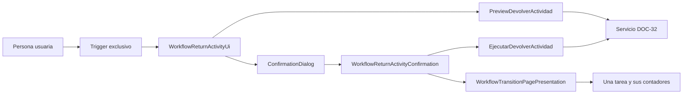

# Arquitectura de interfaz DOC-33

```mermaid
flowchart LR
    U[Persona usuaria] --> T[Trigger exclusivo]
    T --> M[WorkflowReturnActivityUi]
    M --> P[PreviewDevolverActividad]
    P --> S[Servicio DOC-32]
    M --> C[ConfirmationDialog]
    C --> E[WorkflowReturnActivityConfirmation]
    E --> X[EjecutarDevolverActividad]
    X --> S
    E --> R[WorkflowTransitionPagePresentation]
    R --> L[Una tarea y sus contadores]
```

Las flechas de interfaz solo transportan intención mínima. Permisos, Ruta, Flujo, destino, concurrencia y mutación permanecen del lado DOC-32.
