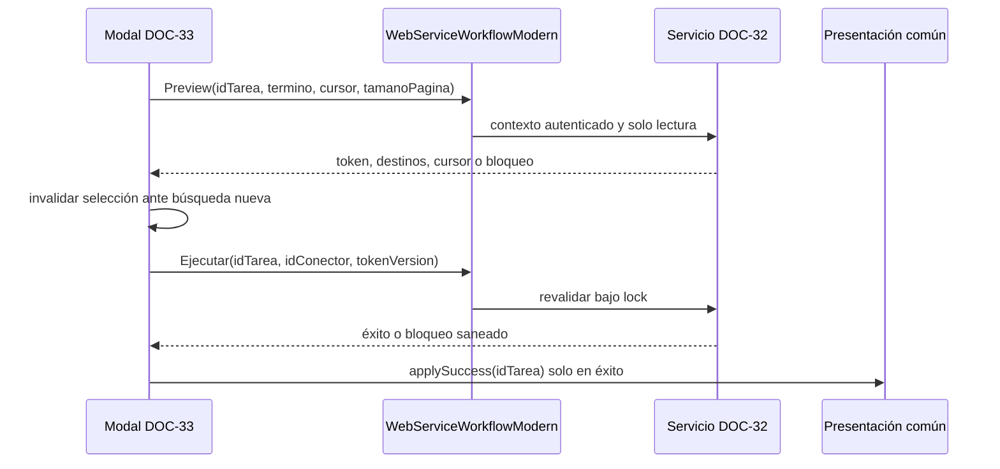

# Preview y ejecución DOC-33

```mermaid
sequenceDiagram
    participant UI as Modal DOC-33
    participant ASMX as WebServiceWorkflowModern
    participant S as Servicio DOC-32
    participant P as Presentación común

    UI->>ASMX: Preview(idTarea, termino, cursor, tamanoPagina)
    ASMX->>S: contexto autenticado y solo lectura
    S-->>UI: token, destinos, cursor o bloqueo
    UI->>UI: invalidar selección ante búsqueda nueva
    UI->>ASMX: Ejecutar(idTarea, idConector, tokenVersion)
    ASMX->>S: revalidar bajo lock
    S-->>UI: éxito o bloqueo saneado
    UI->>P: applySuccess(idTarea) solo en éxito
```

El preview no actualiza tarea, estado ni auditoría. La ejecución es la única solicitud mutante y el servidor decide su validez final.
