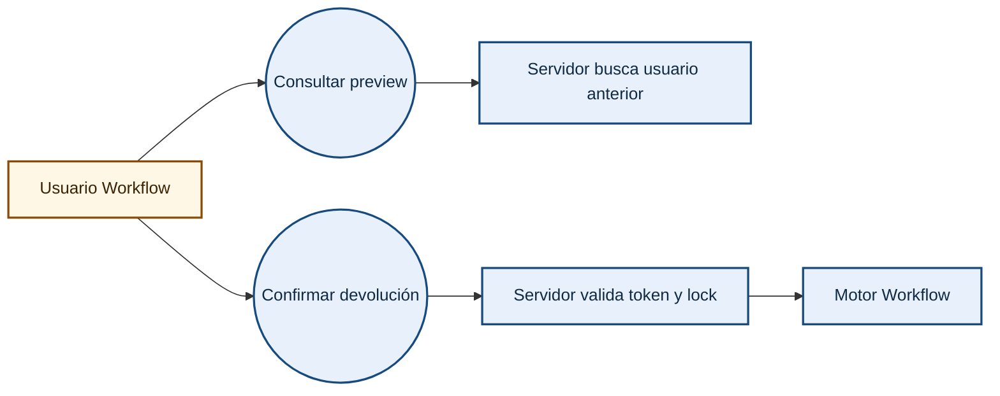

# Casos de uso DOC-36

```mermaid
flowchart LR
  U[Usuario Workflow] --> P((Consultar preview))
  U --> E((Confirmar devolución))
  P --> H[Servidor busca usuario anterior]
  E --> L[Servidor valida token y lock]
  L --> M[Motor Workflow]
  classDef actor fill:#fff7e6,stroke:#8a4b08,color:#3b2405,stroke-width:2px;
  classDef use fill:#e8f1fb,stroke:#174a7e,color:#102a43,stroke-width:2px;
  class U actor; class P,E,H,L,M use;
```
