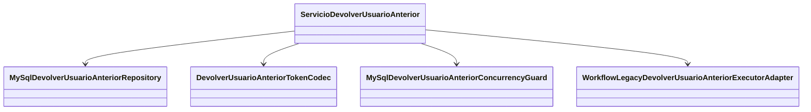

# Clases y puertos DOC-36

```mermaid
classDiagram
  class ServicioDevolverUsuarioAnterior
  class MySqlDevolverUsuarioAnteriorRepository
  class DevolverUsuarioAnteriorTokenCodec
  class MySqlDevolverUsuarioAnteriorConcurrencyGuard
  class WorkflowLegacyDevolverUsuarioAnteriorExecutorAdapter
  ServicioDevolverUsuarioAnterior --> MySqlDevolverUsuarioAnteriorRepository
  ServicioDevolverUsuarioAnterior --> DevolverUsuarioAnteriorTokenCodec
  ServicioDevolverUsuarioAnterior --> MySqlDevolverUsuarioAnteriorConcurrencyGuard
  ServicioDevolverUsuarioAnterior --> WorkflowLegacyDevolverUsuarioAnteriorExecutorAdapter
```
