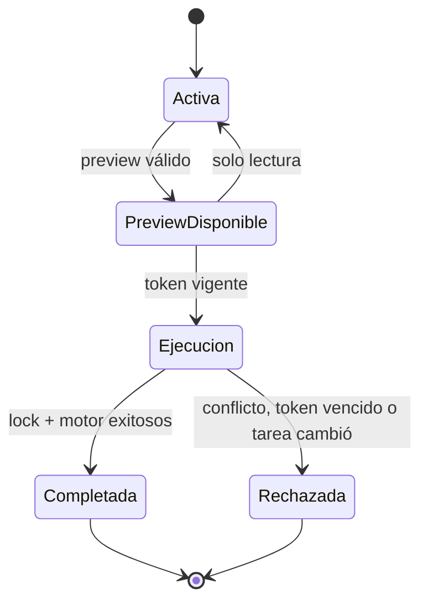

# Estados de devolución DOC-36

```mermaid
stateDiagram-v2
  [*] --> Activa
  Activa --> PreviewDisponible: preview válido
  PreviewDisponible --> Activa: solo lectura
  PreviewDisponible --> Ejecucion: token vigente
  Ejecucion --> Completada: lock + motor exitosos
  Ejecucion --> Rechazada: conflicto, token vencido o tarea cambió
  Completada --> [*]
  Rechazada --> [*]
```
