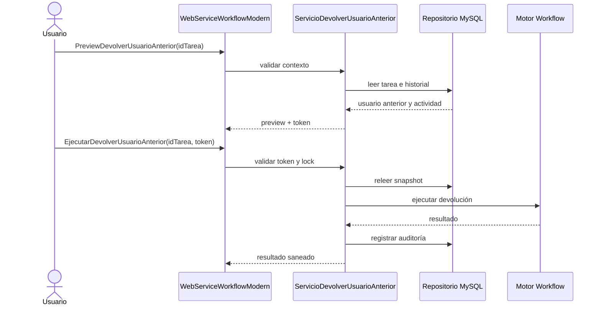

# Secuencia DOC-36

```mermaid
sequenceDiagram
  actor Usuario
  participant ASMX as WebServiceWorkflowModern
  participant Servicio as ServicioDevolverUsuarioAnterior
  participant Repo as Repositorio MySQL
  participant Motor as Motor Workflow
  Usuario->>ASMX: PreviewDevolverUsuarioAnterior(idTarea)
  ASMX->>Servicio: validar contexto
  Servicio->>Repo: leer tarea e historial
  Repo-->>Servicio: usuario anterior y actividad
  Servicio-->>ASMX: preview + token
  Usuario->>ASMX: EjecutarDevolverUsuarioAnterior(idTarea, token)
  ASMX->>Servicio: validar token y lock
  Servicio->>Repo: releer snapshot
  Servicio->>Motor: ejecutar devolución
  Motor-->>Servicio: resultado
  Servicio->>Repo: registrar auditoría
  Servicio-->>ASMX: resultado saneado
```
