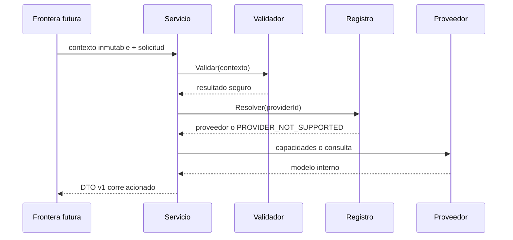

# Secuencia

```mermaid
sequenceDiagram
  participant F as Frontera futura
  participant S as Servicio
  participant V as Validador
  participant R as Registro
  participant P as Proveedor
  F->>S: contexto inmutable + solicitud
  S->>V: Validar(contexto)
  V-->>S: resultado seguro
  S->>R: Resolver(providerId)
  R-->>S: proveedor o PROVIDER_NOT_SUPPORTED
  S->>P: capacidades o consulta
  P-->>S: modelo interno
  S-->>F: DTO v1 correlacionado
```
