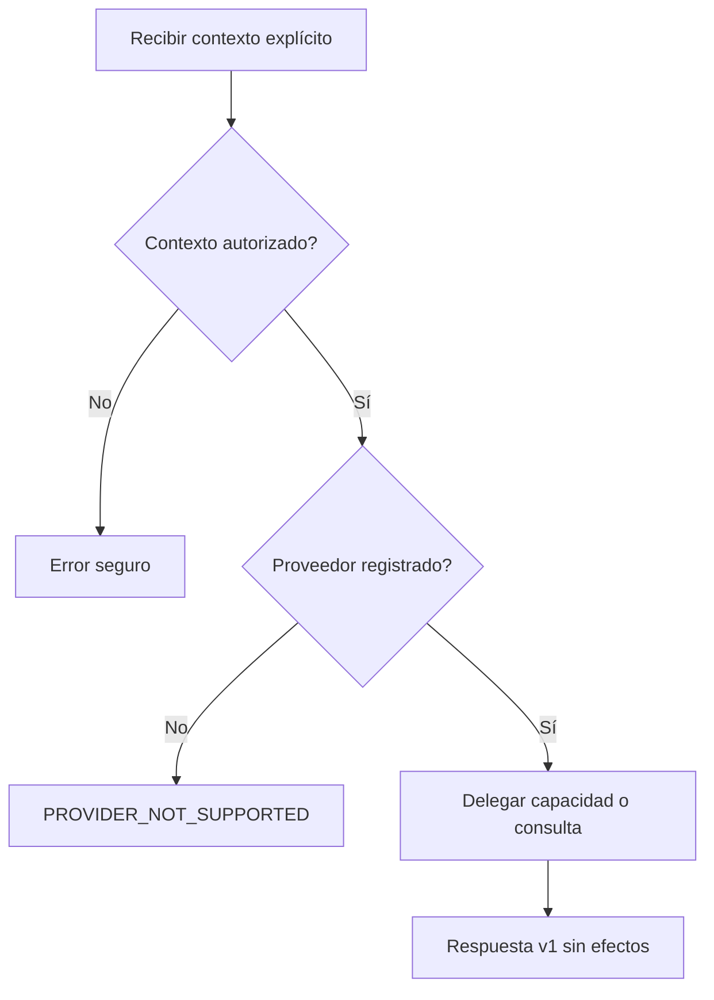

# Flujos

```mermaid
flowchart TD
  A[Recibir contexto explícito] --> B{Contexto autorizado?}
  B -- No --> E[Error seguro]
  B -- Sí --> C{Proveedor registrado?}
  C -- No --> P[PROVIDER_NOT_SUPPORTED]
  C -- Sí --> D[Delegar capacidad o consulta]
  D --> R[Respuesta v1 sin efectos]
```
