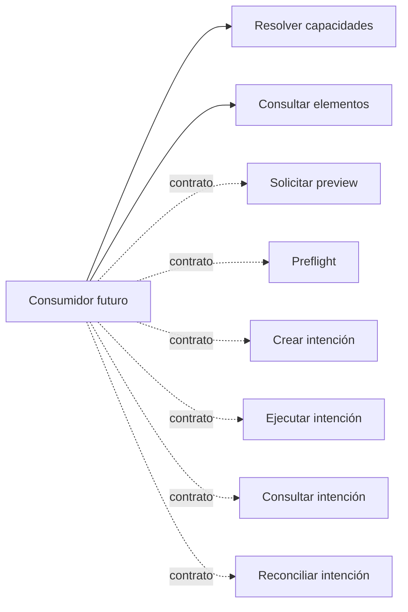

# Casos de uso

```mermaid
flowchart LR
  Consumer[Consumidor futuro] --> RC[Resolver capacidades]
  Consumer --> Q[Consultar elementos]
  Consumer -. contrato .-> PV[Solicitar preview]
  Consumer -. contrato .-> PF[Preflight]
  Consumer -. contrato .-> CI[Crear intención]
  Consumer -. contrato .-> EI[Ejecutar intención]
  Consumer -. contrato .-> GI[Consultar intención]
  Consumer -. contrato .-> RI[Reconciliar intención]
```
