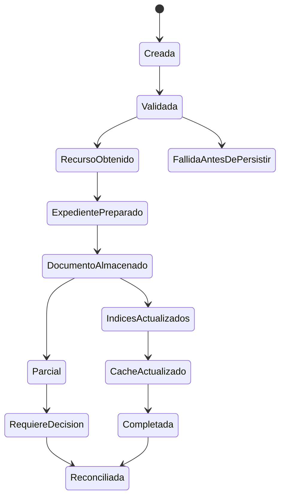

# Estados

```mermaid
stateDiagram-v2
  [*] --> Creada
  Creada --> Validada
  Validada --> RecursoObtenido
  RecursoObtenido --> ExpedientePreparado
  ExpedientePreparado --> DocumentoAlmacenado
  DocumentoAlmacenado --> IndicesActualizados
  IndicesActualizados --> CacheActualizado
  CacheActualizado --> Completada
  Validada --> FallidaAntesDePersistir
  DocumentoAlmacenado --> Parcial
  Parcial --> RequiereDecision
  RequiereDecision --> Reconciliada
  Completada --> Reconciliada
```

Estas transiciones son contractuales y futuras; DOC-50 no las ejecuta ni persiste.
