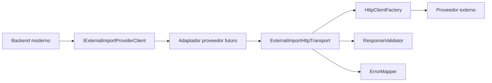

# Componentes

```mermaid
flowchart LR
  Caso[Backend moderno] --> Puerto[IExternalImportProviderClient]
  Puerto --> Adaptador[Adaptador proveedor futuro]
  Adaptador --> Transporte[ExternalImportHttpTransport]
  Transporte --> Fabrica[HttpClientFactory]
  Transporte --> Validador[ResponseValidator]
  Transporte --> Mapper[ErrorMapper]
  Fabrica --> Externo[Proveedor externo]
```
