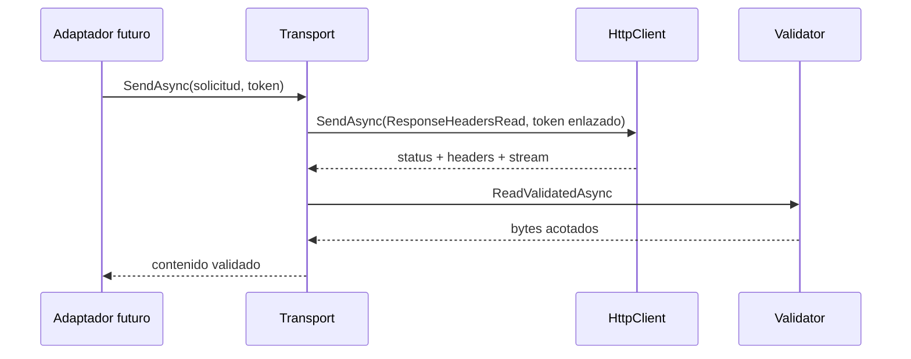

# Secuencia

```mermaid
sequenceDiagram
  participant A as Adaptador futuro
  participant T as Transport
  participant H as HttpClient
  participant V as Validator
  A->>T: SendAsync(solicitud, token)
  T->>H: SendAsync(ResponseHeadersRead, token enlazado)
  H-->>T: status + headers + stream
  T->>V: ReadValidatedAsync
  V-->>T: bytes acotados
  T-->>A: contenido validado
```
