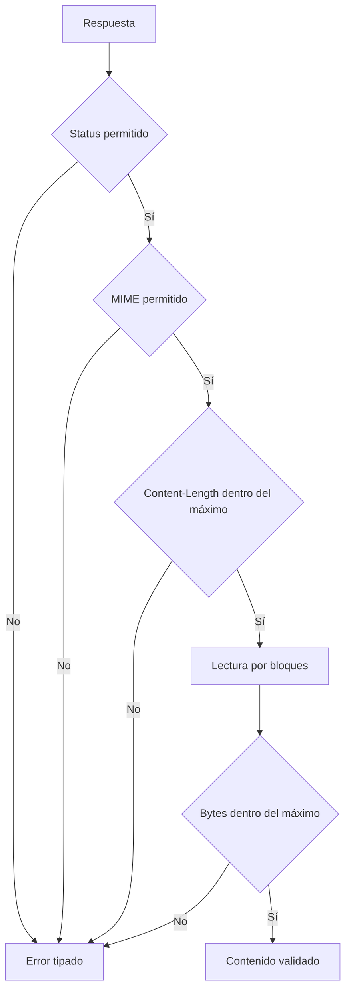

# Validación de respuesta

```mermaid
flowchart TD
  S[Respuesta] --> H{Status permitido}
  H -->|No| E[Error tipado]
  H -->|Sí| M{MIME permitido}
  M -->|No| E
  M -->|Sí| L{Content-Length dentro del máximo}
  L -->|No| E
  L -->|Sí| R[Lectura por bloques]
  R --> B{Bytes dentro del máximo}
  B -->|No| E
  B -->|Sí| OK[Contenido validado]
```
