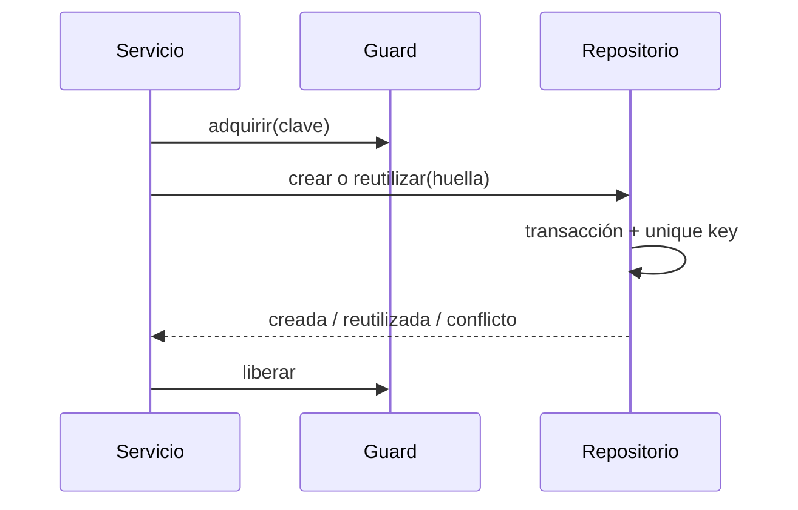

# Secuencia idempotente

```mermaid
sequenceDiagram
 Servicio->>Guard: adquirir(clave)
 Servicio->>Repositorio: crear o reutilizar(huella)
 Repositorio->>Repositorio: transacción + unique key
 Repositorio-->>Servicio: creada / reutilizada / conflicto
 Servicio->>Guard: liberar
```
