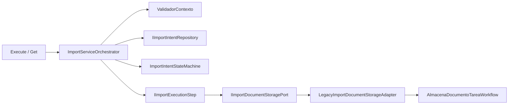

# Componentes

```mermaid
flowchart LR
  API[Execute / Get] --> ORQ[ImportServiceOrchestrator]
  ORQ --> VAL[ValidadorContexto]
  ORQ --> REP[IImportIntentRepository]
  ORQ --> SM[ImportIntentStateMachine]
  ORQ --> STEPS[IImportExecutionStep]
  STEPS --> STORE[IImportDocumentStoragePort]
  STORE --> ADAPTER[LegacyImportDocumentStorageAdapter]
  ADAPTER --> LEGACY[AlmacenaDocumentoTareaWorkflow]
```
