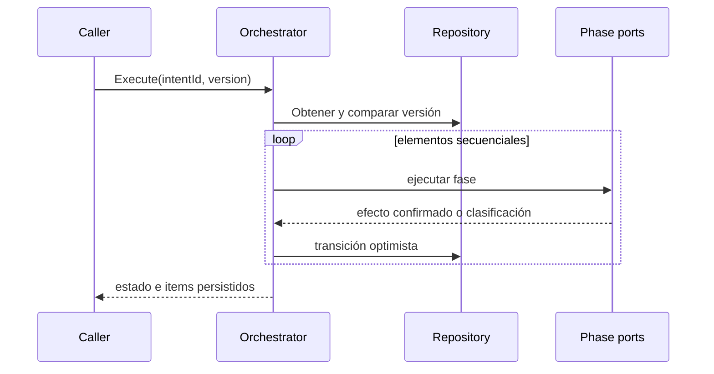
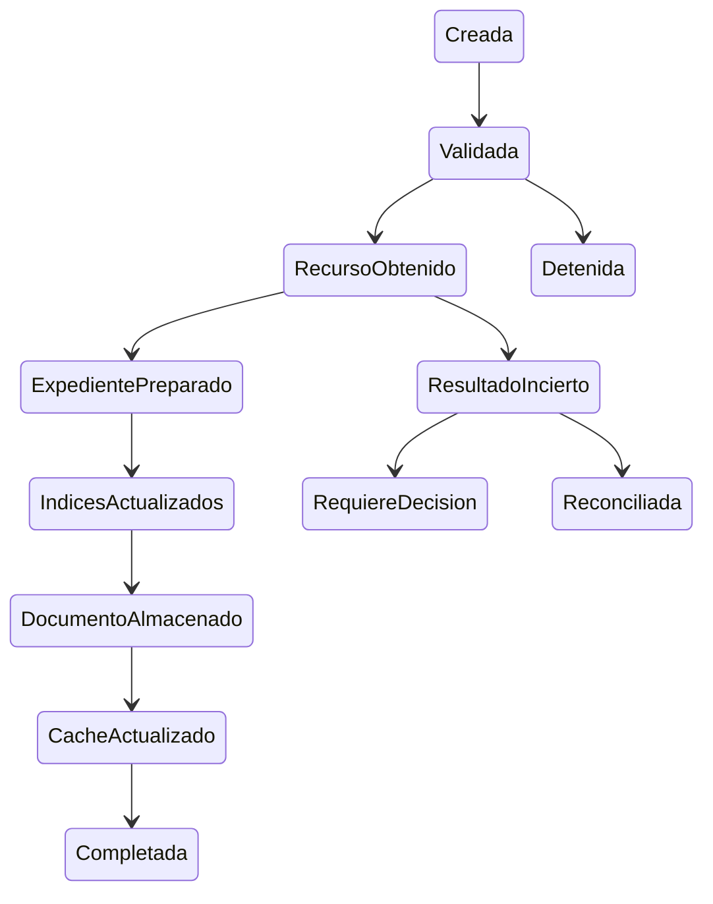

# Secuencia y estados

```mermaid
sequenceDiagram
  participant C as Caller
  participant O as Orchestrator
  participant R as Repository
  participant P as Phase ports
  C->>O: Execute(intentId, version)
  O->>R: Obtener y comparar versión
  loop elementos secuenciales
    O->>P: ejecutar fase
    P-->>O: efecto confirmado o clasificación
    O->>R: transición optimista
  end
  O-->>C: estado e items persistidos
```

```mermaid
stateDiagram-v2
  Creada --> Validada
  Validada --> RecursoObtenido
  RecursoObtenido --> ExpedientePreparado
  ExpedientePreparado --> IndicesActualizados
  IndicesActualizados --> DocumentoAlmacenado
  DocumentoAlmacenado --> CacheActualizado
  CacheActualizado --> Completada
  RecursoObtenido --> ResultadoIncierto
  ResultadoIncierto --> RequiereDecision
  ResultadoIncierto --> Reconciliada
  Validada --> Detenida
```
