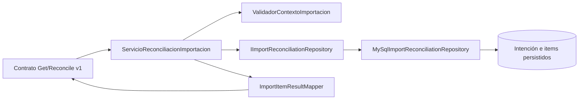

# Componentes

```mermaid
flowchart LR
  C[Contrato Get/Reconcile v1] --> S[ServicioReconciliacionImportacion]
  S --> V[ValidadorContextoImportacion]
  S --> R[IImportReconciliationRepository]
  R --> M[MySqlImportReconciliationRepository]
  M --> DB[(Intención e items persistidos)]
  S --> P[ImportItemResultMapper]
  P --> C
```

El servicio coordina; el repositorio solo lee; el mapper es puro. Ningún componente nuevo llama ASMX, JavaScript, almacenamiento legacy o cachés SII.
