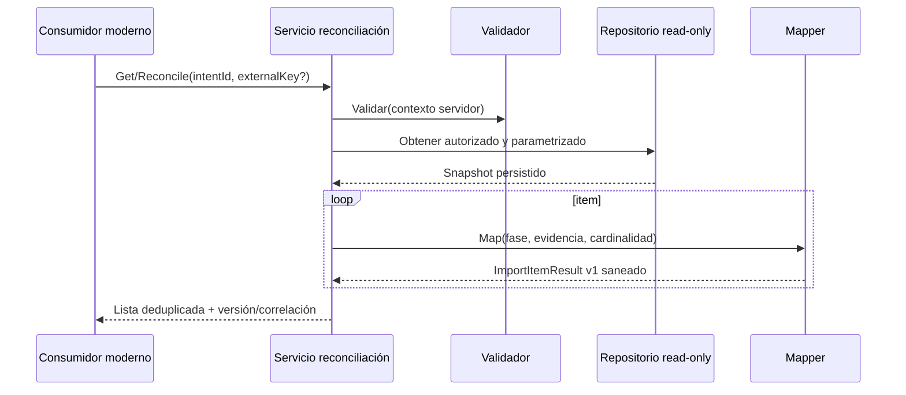

# Secuencia

```mermaid
sequenceDiagram
  participant C as Consumidor moderno
  participant S as Servicio reconciliación
  participant V as Validador
  participant R as Repositorio read-only
  participant M as Mapper
  C->>S: Get/Reconcile(intentId, externalKey?)
  S->>V: Validar(contexto servidor)
  S->>R: Obtener autorizado y parametrizado
  R-->>S: Snapshot persistido
  loop item
    S->>M: Map(fase, evidencia, cardinalidad)
    M-->>S: ImportItemResult v1 saneado
  end
  S-->>C: Lista deduplicada + versión/correlación
```
