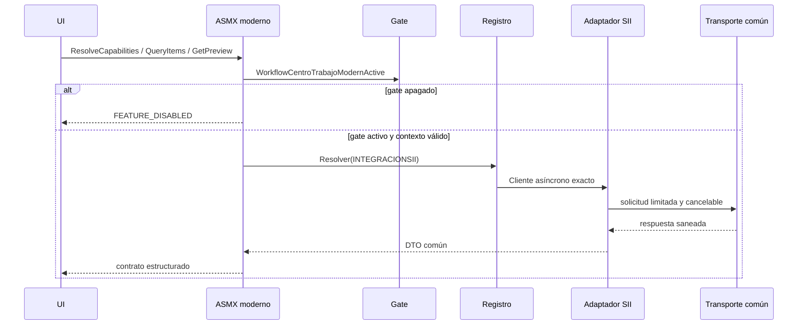

# Flujo moderno SII

```mermaid
sequenceDiagram
    participant UI
    participant ASMX as ASMX moderno
    participant Gate
    participant Registro
    participant SII as Adaptador SII
    participant HTTP as Transporte común

    UI->>ASMX: ResolveCapabilities / QueryItems / GetPreview
    ASMX->>Gate: WorkflowCentroTrabajoModernActive
    alt gate apagado
        ASMX-->>UI: FEATURE_DISABLED
    else gate activo y contexto válido
        ASMX->>Registro: Resolver(INTEGRACIONSII)
        Registro->>SII: Cliente asíncrono exacto
        SII->>HTTP: solicitud limitada y cancelable
        HTTP-->>SII: respuesta saneada
        SII-->>ASMX: DTO común
        ASMX-->>UI: contrato estructurado
    end
```

