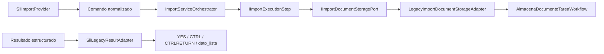

# Persistencia y compatibilidad

```mermaid
flowchart LR
    SII[SiiImportProvider] --> CMD[Comando normalizado]
    CMD --> ORQ[ImportServiceOrchestrator]
    ORQ --> STEP[IImportExecutionStep]
    STEP --> PORT[IImportDocumentStoragePort]
    PORT --> ADAPTER[LegacyImportDocumentStorageAdapter]
    ADAPTER --> LEGACY[AlmacenaDocumentoTareaWorkflow]
    RESULT[Resultado estructurado] --> COMPAT[SiiLegacyResultAdapter]
    COMPAT --> CODES[YES / CTRL / CTRLRETURN / dato_lista]
```

El adaptador de almacenamiento es el único límite moderno que invoca la caja negra legacy. La traducción de códigos también queda confinada a un único adaptador.
