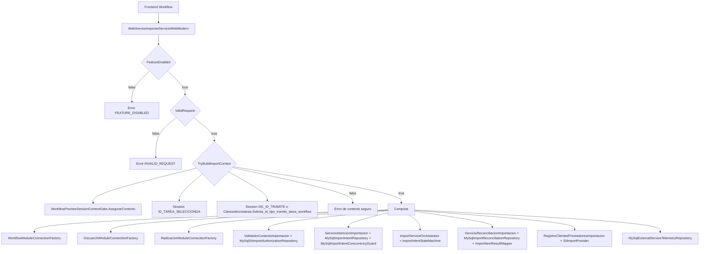

# 01 — Frontera ASMX y composición

Fuente: `webservice/WebServiceImportarServicioWebModern.asmx.vb`.

Operaciones que atraviesan esta frontera: `ResolveCapabilities`, `QueryItems`, `GetPreview`, `PreflightImport`, `CreateImportIntent`, `ExecuteImportIntent`, `GetImportIntent` y `ReconcileImportIntent`.
