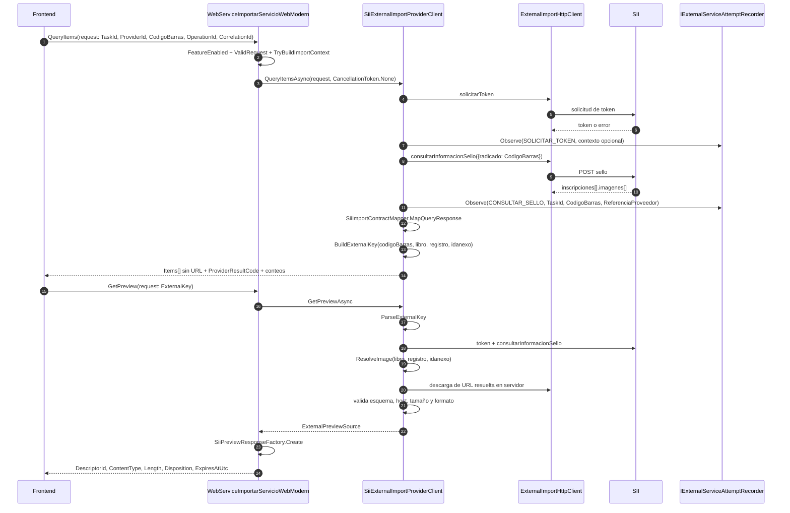

# 02 — Consulta y preview SII

Fuentes: `SiiExternalImportProviderClient.vb`, `SiiImportProvider.vb`, `SiiImportContractMapper.vb`, `SiiPreviewResponseFactory.vb`.

La URL de imagen y el token no aparecen en ningún DTO público.
