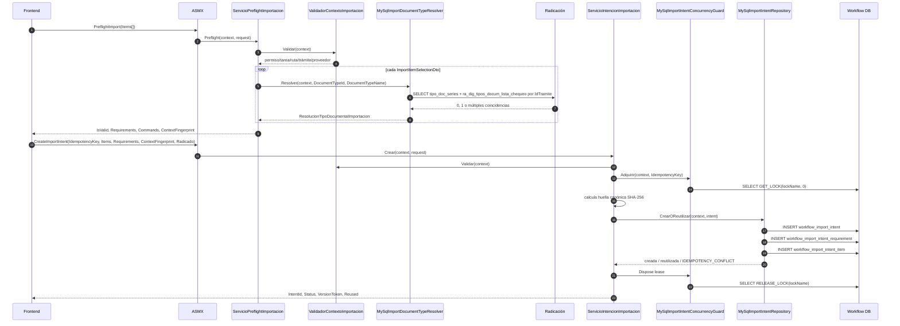

# 03 — Preflight, idempotencia e intención

Fuentes: `ServicioPreflightImportacion.vb`, `ServicioIntencionImportacion.vb`, `MySqlImportDocumentTypeResolver.vb`, `MySqlImportIntentRepository.vb`, `MySqlImportIntentConcurrencyGuard.vb`.

El ID de lista de chequeo resuelto durante preflight no cruza el contrato; se vuelve a resolver antes del almacenamiento.
