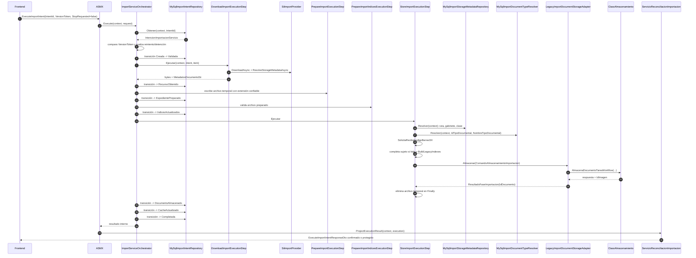

# 04 — Ejecución y almacenamiento

Fuentes: `ImportServiceOrchestrator.vb`, `ImportExecutionSteps.vb`, `LegacyImportDocumentStorageAdapter.vb`.

Cada llamada a `ActualizarTransicion` actualiza item e intención y agrega una fila de auditoría con control de versión.
