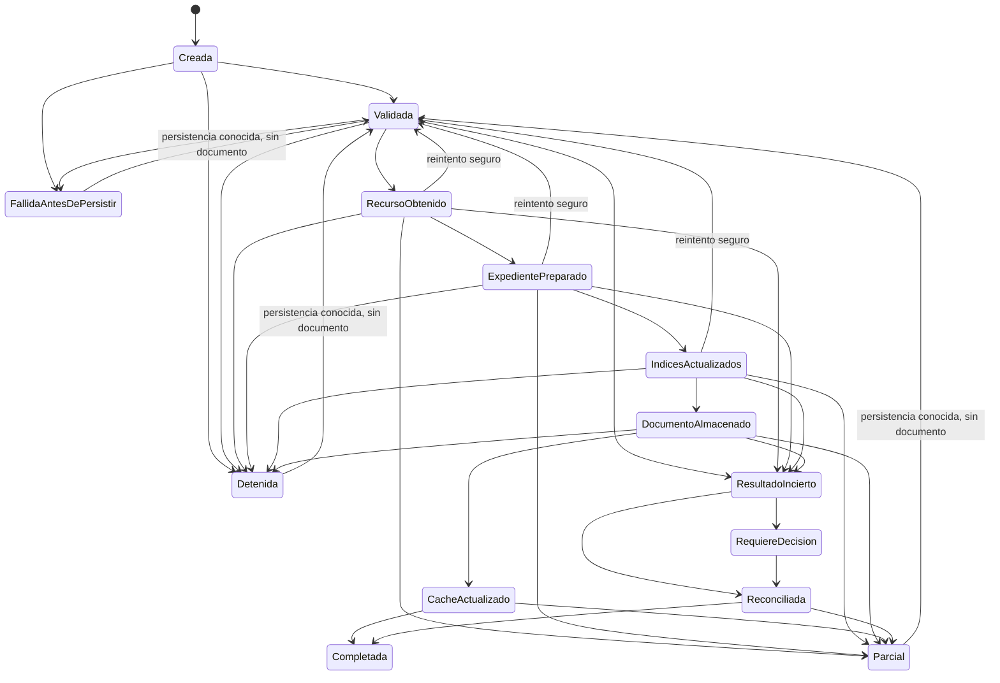

# 05 — Máquina de estados y reintento

Fuente: `ImportIntentStateMachine.CrearTabla` e `ImportServiceOrchestrator.EsReintentoSeguro`.

`EsReintentoSeguro` rechaza cualquier item con persistencia desconocida o `IdDocumento` ya asignado. `ResultadoIncierto` no se reintenta automáticamente.
