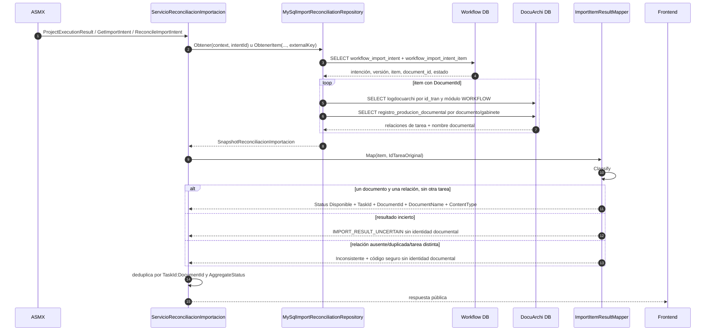

# 06 — Reconciliación y contrato de salida

Fuentes: `ServicioReconciliacionImportacion.vb`, `MySqlImportReconciliationRepository.vb`, `ImportItemResultMapper.vb`.

Clasificaciones exactas: `Confirmado`, `ResultadoIncierto`, `RelacionDuplicada`, `TareaDistinta`, `RelacionAusente` y `NoConfirmado`.
