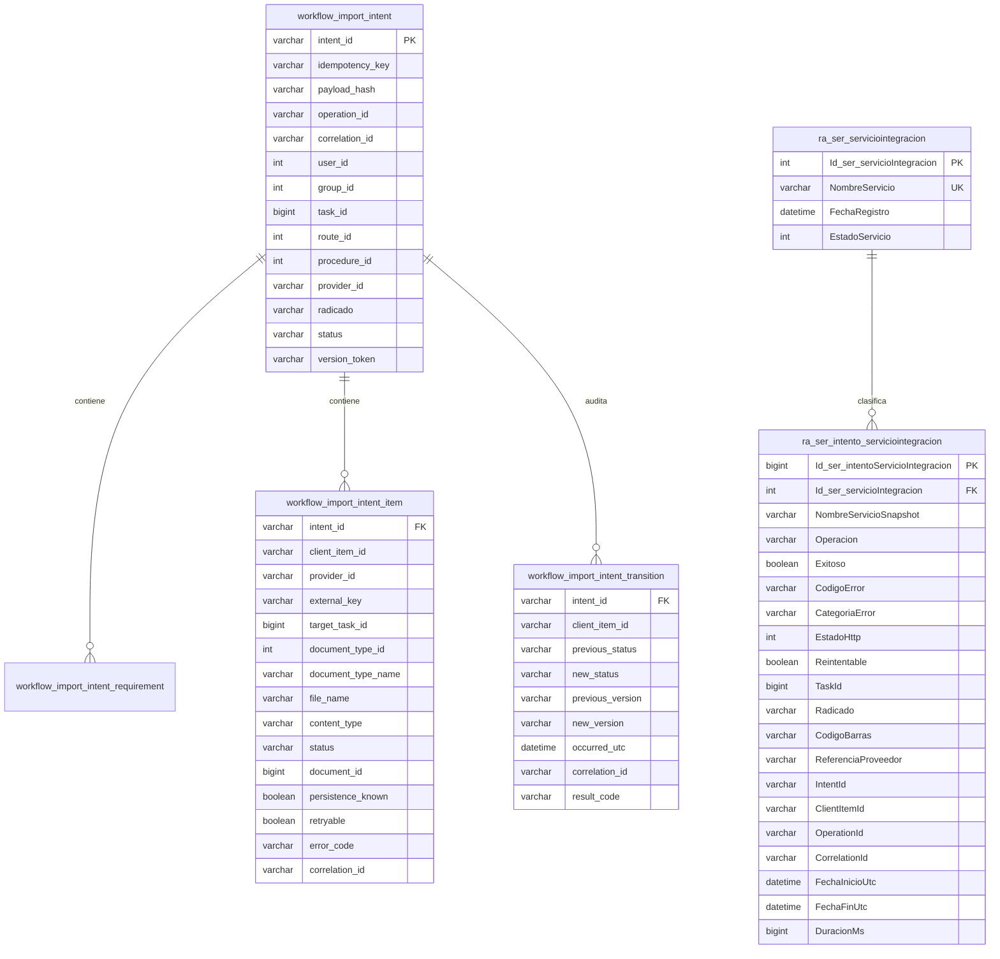

# 07 — Persistencia y telemetría

Fuentes: migraciones SQL y repositorios `MySqlImportIntentRepository`, `MySqlImportReconciliationRepository`, `MySqlExternalServiceTelemetryRepository`.

La FK de telemetría es exclusivamente local a DocuArchi. `IntentId`, tarea, radicado, código de barras y referencia son snapshots opcionales, sin FK entre bases y sin exigir código de barras a otros proveedores.
