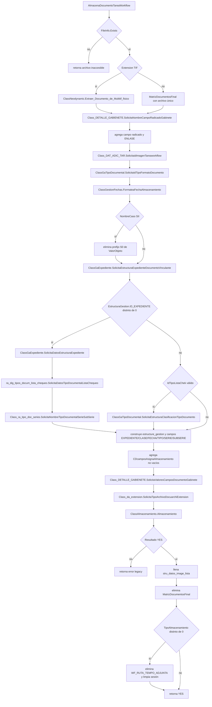

# 08 — Interior del almacenamiento legacy reutilizado

Fuente: `workflow/ClassAlmacenamiento.vb`, función de solo lectura `AlmacenaDocumentoTareaWorkflow`.

Parámetros formales: `ActivaGuardaValorRadicado`, `NombreGabinete`, `Radicado`, `RutaArchivoAlmacenar`, `NombreRutaWorkflow`, `IdRutaWorkflow`, `IdTareaWorkflow`, `DescripcionTipo`, `IdTipoListaChek`, `TipoAlmacenamiento`, `CDcamposAsignaAlmacenamiento`, `ValorObjeto`, `NombreCaso`, `NombreClaseFormatoDocumento`, `IdImagenAlamacenada` y `EstructuraDatosImagen`.

La ruta moderna no duplica estas operaciones: construye el comando, invoca esta función una vez y reconcilia después usando datos persistidos.
