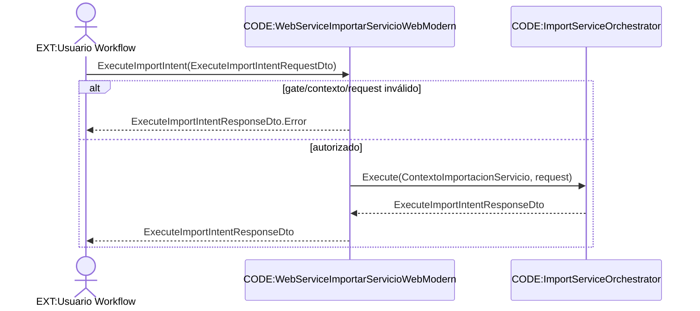

# Frontera y endpoints

Fuentes: `webservice/WebServiceImportarServicioWebModern.asmx.vb`.

Referencias CODE: `WebServiceImportarServicioWebModern.ExecuteImportIntent(ExecuteImportIntentRequestDto):ExecuteImportIntentResponseDto`; `ImportServiceOrchestrator.Execute(ContextoImportacionServicio,ExecuteImportIntentRequestDto):ExecuteImportIntentResponseDto`.

