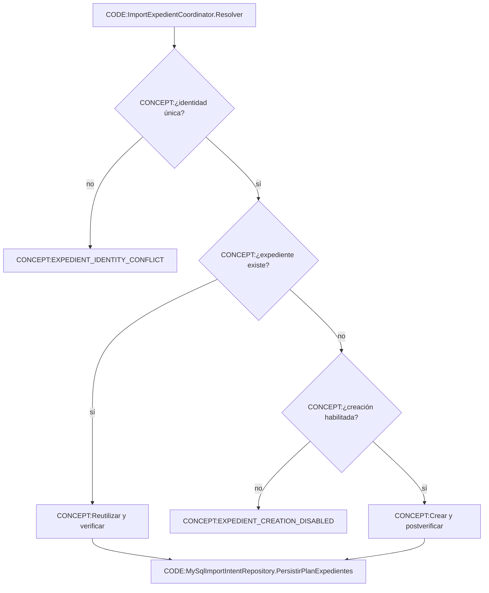

# Resolución de expediente

Fuentes: `Services/Workflow/ImportarServicioWeb/ImportExpedientCoordinator.vb`, `Infrastructure/Repositories/Workflow/ImportarServicioWeb/MySqlImportIntentRepository.vb`.

Referencias CODE: `ImportExpedientCoordinator.Resolver(ContextoImportacionServicio,IntencionImportacionServicio):PlanExpedienteImportacion`; `MySqlImportIntentRepository.PersistirPlanExpedientes(ContextoImportacionServicio,IntencionImportacionServicio,PlanExpedienteImportacion):Boolean`.

