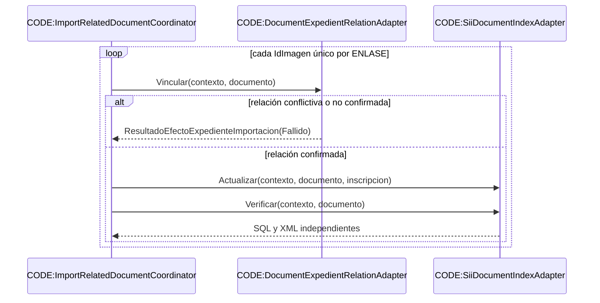

# Saga de documentos relacionados

Fuentes: `Services/Workflow/ImportarServicioWeb/ImportRelatedDocumentCoordinator.vb`, `Infrastructure/Workflow/ImportarServicioWeb/Expedients/DocumentExpedientRelationAdapter.vb`, `Infrastructure/Workflow/ImportarServicioWeb/Expedients/SiiDocumentIndexAdapter.vb`.

Referencias CODE: `ImportRelatedDocumentCoordinator.Procesar(ContextoImportacionServicio,IntencionImportacionServicio,PlanExpedienteImportacion,String,String):PlanDocumentosRelacionadosImportacion`; `DocumentExpedientRelationAdapter.Vincular(ContextoImportacionServicio,DocumentoRelacionadoImportacion):ResultadoEfectoExpedienteImportacion`; `SiiDocumentIndexAdapter.Actualizar(ContextoImportacionServicio,DocumentoRelacionadoImportacion,InscripcionImportacion):ResultadoEfectoExpedienteImportacion`; `SiiDocumentIndexAdapter.Verificar(ContextoImportacionServicio,DocumentoRelacionadoImportacion):EvidenciaIndiceElectronicoImportacion`.

