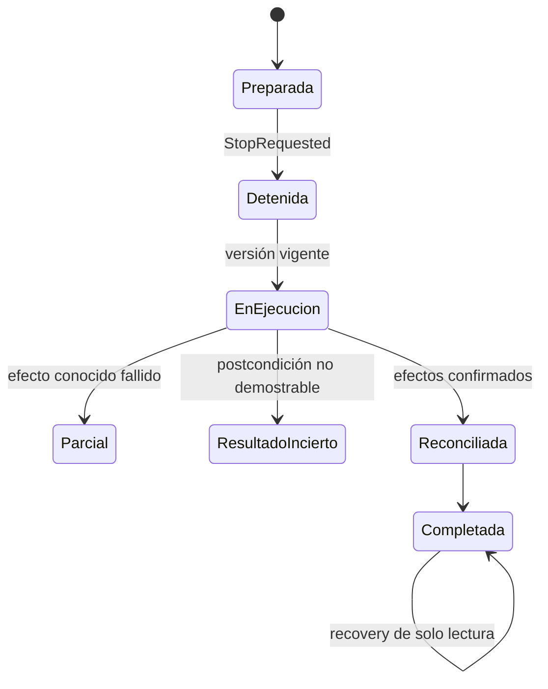

# Detención, retry y recovery

Fuentes: `Services/Workflow/ImportarServicioWeb/ImportServiceOrchestrator.vb`, `Services/Workflow/ImportarServicioWeb/ImportIntentStateMachine.vb`.

Referencias CODE: `ImportServiceOrchestrator.Execute(ContextoImportacionServicio,ExecuteImportIntentRequestDto):ExecuteImportIntentResponseDto`.

