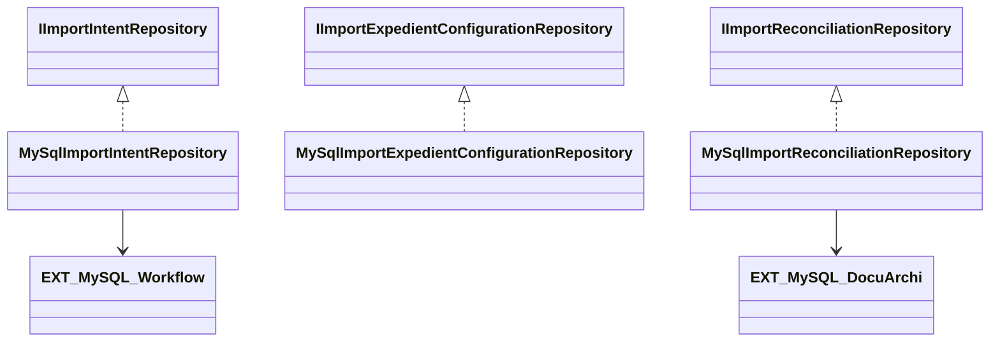

# Componentes y persistencia

Fuentes: `Modelo/Workflow/ImportarServicioWeb/ImportarServicioWebInterfaces.vb`, `Infrastructure/Repositories/Workflow/ImportarServicioWeb/`.

Referencias CODE: `IImportIntentRepository`; `MySqlImportIntentRepository`; `IImportExpedientConfigurationRepository`; `MySqlImportExpedientConfigurationRepository`; `IImportReconciliationRepository`; `MySqlImportReconciliationRepository`.

