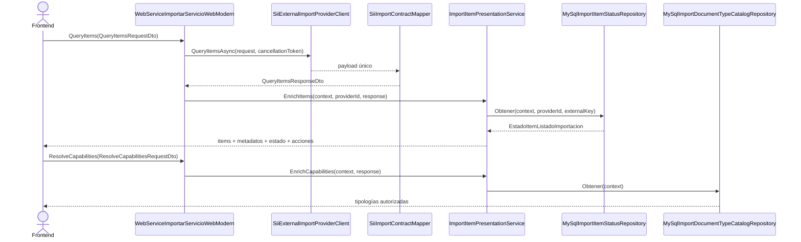

# Flujo técnico

```mermaid
sequenceDiagram
    actor UI as Frontend
    participant API as WebServiceImportarServicioWebModern
    participant SII as SiiExternalImportProviderClient
    participant Mapper as SiiImportContractMapper
    participant Presentation as ImportItemPresentationService
    participant Workflow as MySqlImportItemStatusRepository
    participant Radicacion as MySqlImportDocumentTypeCatalogRepository
    UI->>API: QueryItems(QueryItemsRequestDto)
    API->>SII: QueryItemsAsync(request, cancellationToken)
    SII-->>Mapper: payload único
    Mapper-->>API: QueryItemsResponseDto
    API->>Presentation: EnrichItems(context, providerId, response)
    Presentation->>Workflow: Obtener(context, providerId, externalKey)
    Workflow-->>Presentation: EstadoItemListadoImportacion
    Presentation-->>UI: items + metadatos + estado + acciones
    UI->>API: ResolveCapabilities(ResolveCapabilitiesRequestDto)
    API->>Presentation: EnrichCapabilities(context, response)
    Presentation->>Radicacion: Obtener(context)
    Radicacion-->>UI: tipologías autorizadas
```
