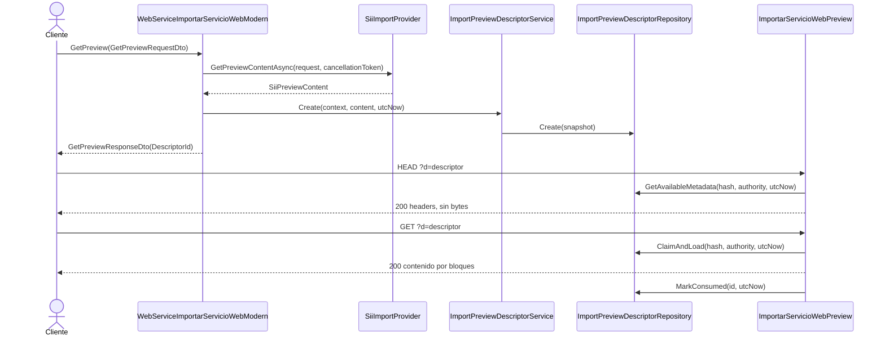

# Secuencia

Fuentes: `WebServiceImportarServicioWebModern.GetPreview`, `SiiImportProvider.GetPreviewContentAsync`, `ImportPreviewDescriptorService.Create`, `ImportarServicioWebPreview.ProcessRequest`, `ImportPreviewContentService.Head`, `ImportPreviewContentService.Claim`.

