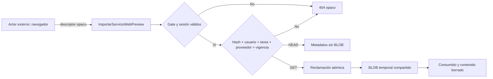

# Fronteras de confianza

Fuentes: `WorkflowPreviewSessionContextGate.AsegurarContexto`, `ImportPreviewDescriptorService.DescriptorHash`, `ImportPreviewDescriptorRepository.ClaimAndLoad`.

```mermaid
flowchart LR
  C[Actor externo: navegador] -->|descriptor opaco| H[ImportarServicioWebPreview]
  H --> G{Gate y sesión válidos}
  G -->|No| E[404 opaco]
  G -->|Sí| A{Hash + usuario + tarea + proveedor + vigencia}
  A -->|No| E
  A -->|HEAD| M[Metadatos sin BLOB]
  A -->|GET| R[Reclamación atómica]
  R --> B[BLOB temporal compartido]
  B --> X[Consumido y contenido borrado]
```
