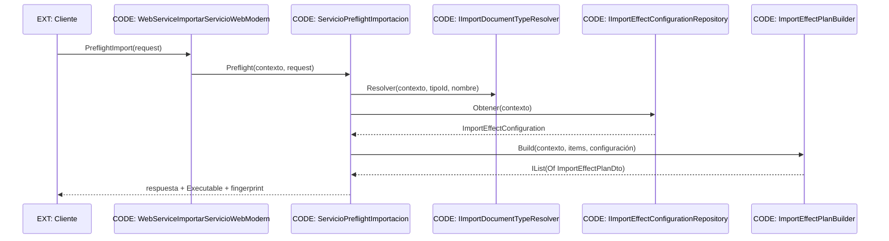

# Arquitectura y secuencia

`CreateImportIntent` recompone el mismo preflight y compara huella y requisitos antes de `_guard.Adquirir`. El plan es lógico; `ImportServiceOrchestrator` conserva la única ruta que materializa efectos DOC-67.
