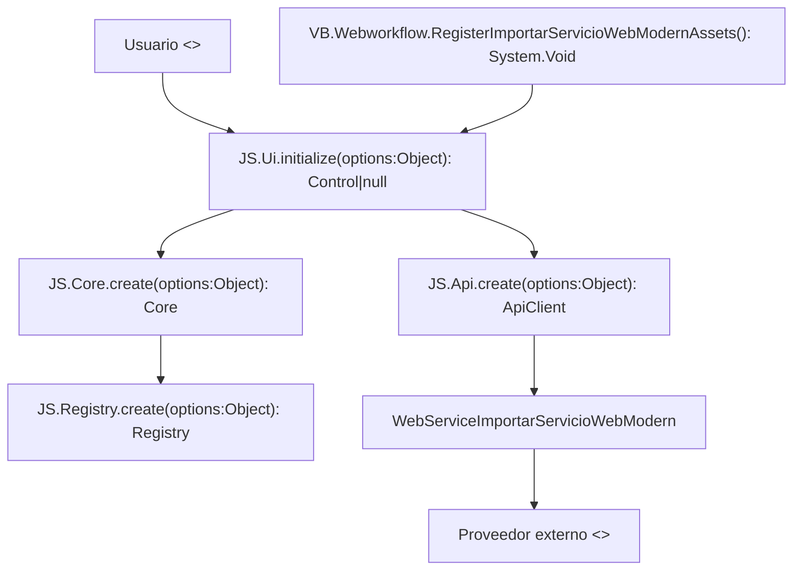

# Componentes DOC-72

## Convención

- Nodos `JS.*` y `VB.*`: símbolos de código validados automáticamente.
- `EXT_*`: `<<external>>`, no se resuelve contra código.
- `CONCEPT_*`: `<<conceptual>>`, no representa una clase.

## Diagrama

## Fuentes

- `js/workflow/importar-servicio-web/importar-servicio-web-{api,provider-registry,core,ui}.js`
- `workflow/Webworkflow.aspx.vb`
- `webservice/WebServiceImportarServicioWebModern.asmx.vb`

Símbolos: `JS.Api.create`, `JS.Registry.create`, `JS.Core.create`, `JS.Ui.initialize`, `VB.Webworkflow.RegisterImportarServicioWebModernAssets`.
