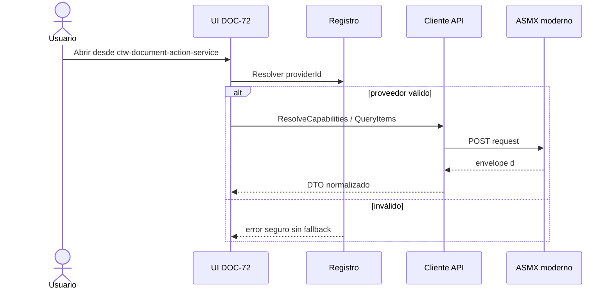

# Secuencia

```mermaid
sequenceDiagram
    actor U as Usuario
    participant UI as UI DOC-72
    participant R as Registro
    participant API as Cliente API
    participant WS as ASMX moderno
    U->>UI: Abrir desde ctw-document-action-service
    UI->>R: Resolver providerId
    alt proveedor válido
        UI->>API: ResolveCapabilities / QueryItems
        API->>WS: POST request
        WS-->>API: envelope d
        API-->>UI: DTO normalizado
    else inválido
        R-->>UI: error seguro sin fallback
    end
```
