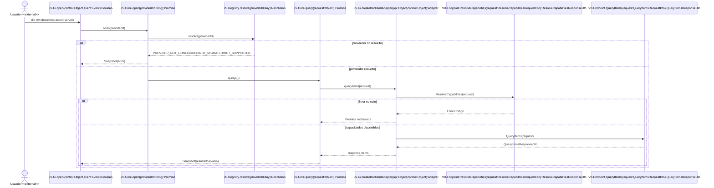

# Secuencia de apertura y consulta

## Convención

- Participantes `JS.*`/`VB.*`: funciones o métodos reales.
- `Usuario`: actor `<<external>>` excluido de resolución.
- Los tipos son formas documentales JavaScript o tipos .NET exactos.

## Diagrama

## Fuentes

- `js/workflow/importar-servicio-web/importar-servicio-web-ui.js`
- `js/workflow/importar-servicio-web/importar-servicio-web-core.js`
- `js/workflow/importar-servicio-web/importar-servicio-web-provider-registry.js`
- `webservice/WebServiceImportarServicioWebModern.asmx.vb`
- `DTOs/Workflow/ImportarServicioWeb/ImportarServicioWebDtos.vb`

Símbolos: `JS.Ui.open`, `JS.Core.open`, `JS.Registry.resolve`, `JS.Core.query`, `JS.Ui.createBackendAdapter`, `VB.Endpoint.ResolveCapabilities`, `VB.Endpoint.QueryItems`.
