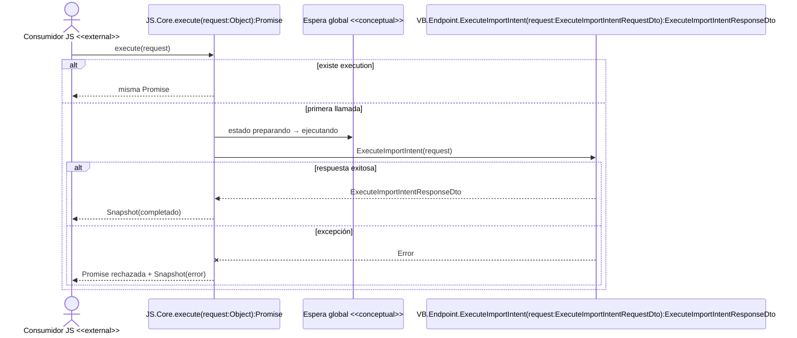

# Secuencia de ejecución única programática

## Convención

- `Consumidor JS`: actor `<<external>>`; hoy no corresponde a un botón del modal.
- `Espera global`: elemento `<<conceptual>>`.
- `JS.*` y `VB.*`: símbolos validados.

## Diagrama

## Fuentes

- `js/workflow/importar-servicio-web/importar-servicio-web-core.js`
- `js/workflow/importar-servicio-web/importar-servicio-web-ui.js`
- `webservice/WebServiceImportarServicioWebModern.asmx.vb`

Símbolos: `JS.Core.execute`, `VB.Endpoint.ExecuteImportIntent`.
