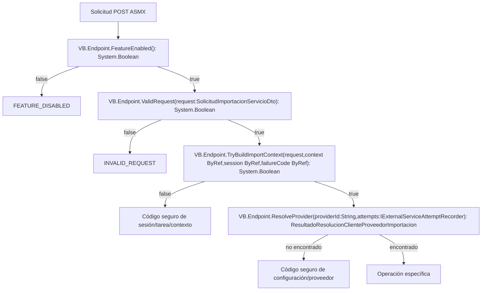

# Validaciones y errores del borde ASMX

## Convención

- `VB.*`: método real validado por reflexión, incluida sobrecarga exacta.
- Nodos de decisión: condiciones implementadas.
- Códigos de error: valores funcionales devueltos por DTO.

## Diagrama

## Fuentes

- `webservice/WebServiceImportarServicioWebModern.asmx.vb`
- `Modelo/Workflow/ImportarServicioWeb/ImportarServicioWebInterfaces.vb`
- `DTOs/Workflow/ImportarServicioWeb/ImportarServicioWebDtos.vb`

Símbolos: `VB.Endpoint.FeatureEnabled`, `VB.Endpoint.ValidRequest`, `VB.Endpoint.TryBuildImportContext`, `VB.Endpoint.ResolveProvider`.
