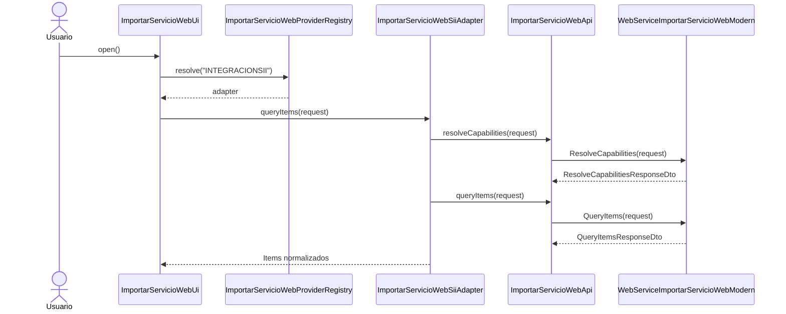

# Consulta

```mermaid
sequenceDiagram
    actor Usuario
    participant UI as ImportarServicioWebUi
    participant Registry as ImportarServicioWebProviderRegistry
    participant Adapter as ImportarServicioWebSiiAdapter
    participant API as ImportarServicioWebApi
    participant ASMX as WebServiceImportarServicioWebModern
    Usuario->>UI: open()
    UI->>Registry: resolve("INTEGRACIONSII")
    Registry-->>UI: adapter
    UI->>Adapter: queryItems(request)
    Adapter->>API: resolveCapabilities(request)
    API->>ASMX: ResolveCapabilities(request)
    ASMX-->>API: ResolveCapabilitiesResponseDto
    Adapter->>API: queryItems(request)
    API->>ASMX: QueryItems(request)
    ASMX-->>API: QueryItemsResponseDto
    Adapter-->>UI: Items normalizados
```

