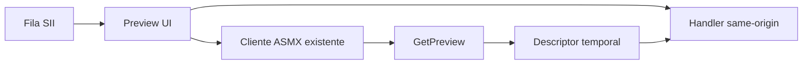
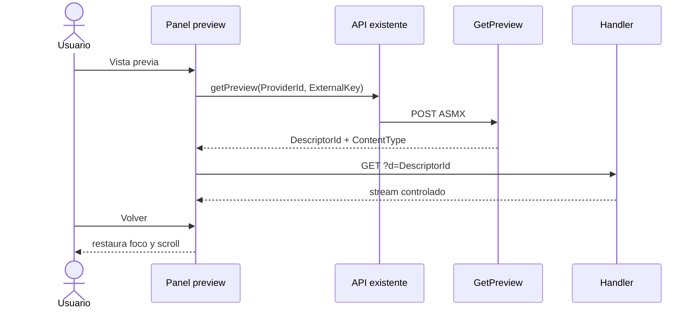
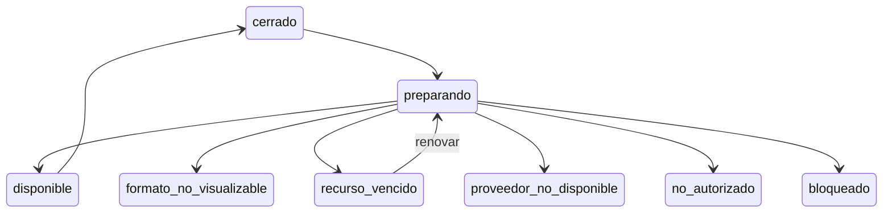

# Diagramas

## Componentes

```mermaid
flowchart LR
  F[Fila SII] --> UI[Preview UI]
  UI --> API[Cliente ASMX existente]
  API --> GP[GetPreview]
  GP --> DS[Descriptor temporal]
  UI --> H[Handler same-origin]
  DS --> H
```

## Secuencia principal

```mermaid
sequenceDiagram
  actor U as Usuario
  participant UI as Panel preview
  participant API as API existente
  participant B as GetPreview
  participant H as Handler
  U->>UI: Vista previa
  UI->>API: getPreview(ProviderId, ExternalKey)
  API->>B: POST ASMX
  B-->>UI: DescriptorId + ContentType
  UI->>H: GET ?d=DescriptorId
  H-->>UI: stream controlado
  U->>UI: Volver
  UI-->>U: restaura foco y scroll
```

## Estados

```mermaid
stateDiagram-v2
  cerrado --> preparando
  preparando --> disponible
  preparando --> formato_no_visualizable
  preparando --> recurso_vencido
  preparando --> proveedor_no_disponible
  preparando --> no_autorizado
  preparando --> bloqueado
  recurso_vencido --> preparando: renovar
  disponible --> cerrado
```

Diagrama individual: [secuencia](Diagramas/secuencia-preview.md).
